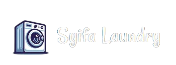
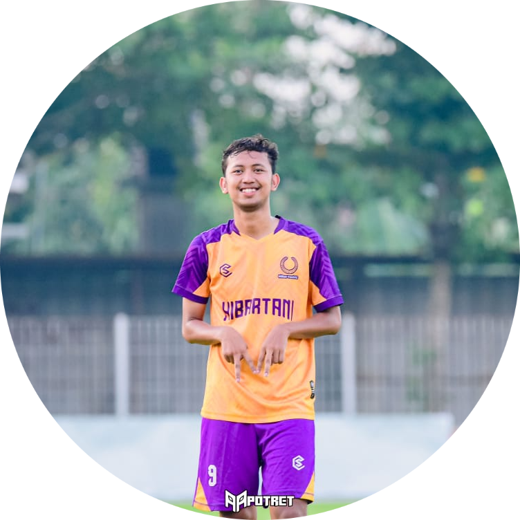
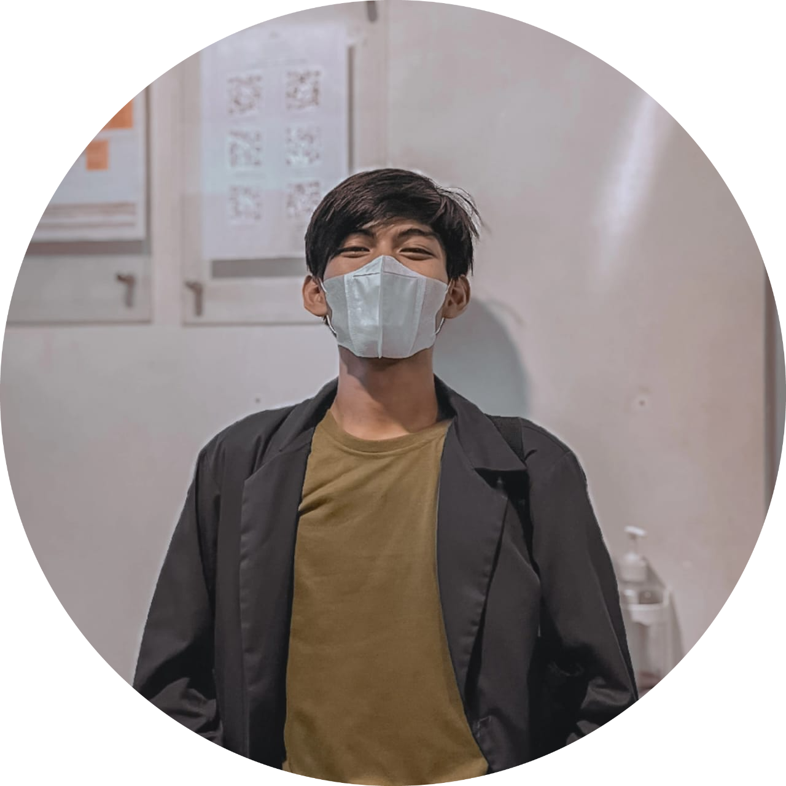

<p align="center">
  <a href="https://syifa-laundry.project-web.my.id" target="_blank">
    
  </a>
</p>

<h1 align="center">Syifa Laundry App</h1>
<p align="center">Simple and Efficient Laundry Management System.</p>

---

<p align="center">
  <!-- Laravel -->
  <a href="https://github.com/laravel/framework/actions">
    
  </a>
  <a href="https://packagist.org/packages/laravel/framework">
    
  </a>
  <a href="https://packagist.org/packages/laravel/framework">
    
  </a>
  <a href="https://packagist.org/packages/laravel/framework">
    
  </a>
  <!-- PHP -->
  
  <!-- VSCode -->
  
  <!-- MySQL -->
  
  <!-- Apache -->
  
  <!-- Chrome -->
  
</p>

---

## 🛠️ Tech Stack

- [PHP](https://www.php.net/) — General-purpose scripting language, powerful for web development.
- [XAMPP](https://www.apachefriends.org/download.html) — Apache distribution with MariaDB, PHP, and Perl.
- [LARAGON](https://laragon.org/docs/) — Lightweight development environment for PHP, Node.js, and more.
- [VSCode](https://code.visualstudio.com/) — Open-source code editor with great extension support.
- [Google Chrome](https://www.google.com.sg/?hl=id) — Recommended browser for development and testing.

---

## 📋 Requirements

- PHP v8.0.1
- XAMPP v3.3.0
- LARAGON v3.1.7
- VSCode v1.80.0+
- PowerShell v5.1.2
- MySQL/MariaDB

---

## 🗂️ Project Structure


```
📦laundry
┣ 📂app
┣ 📂public
┣ 📂vendor
┣ 📜.env
┣ 📜.gitignore
┣ 📜.htaccess
┣ 📜composer.json
┣ 📜composer.lock
┣ 📜README.md
┗ 📜run.php
```

## 🚀 Installation Guide

### ⚙️ 1. Setup Environment

- Import file `db_laundry.sql` ke database kalian.
- Ubah konfigurasi di file `.env` sesuai dengan koneksi lokalmu (`DB_HOST`, `DB_NAME`, dll).

### 💻 2. Jalankan dengan PHP CLI

> Pastikan PHP sudah ditambahkan ke `Environment Variables`.

```bash
php run.php
````

### 🌐 3. Jalankan dengan XAMPP

* Simpan folder ini ke dalam direktori `htdocs`.
* Ubah `BASE_URL` di `.env` agar sesuai dengan URL XAMPP lokal (contoh: `http://localhost/laundry`).

### 🌐 4. Jalankan dengan Laragon

* Sama seperti XAMPP, tapi gunakan domain `.test` dari Laragon.
* Contoh: jika folder bernama `laundry`, maka URL akan menjadi `http://laundry.test`.

---

## 👨‍💻 Development Team

<table align="center">
  <tr>
    <td align="center">
      <br />
      <b>Ilham Abi Gumelar</b><br />
      <i>UI/UX Designer</i>
    </td>
    <td align="center">
      <br />
      <b>Firmansyah Maulana</b><br />
      <i>Quality Assurance</i>
    </td>
    <td align="center">
      <br />
      <b>Fahmi Idris Anjounghan</b><br />
      <i>Fullstack Developer</i>
    </td>
  </tr>
</table>


---

## 📄 License

This project is for internal educational and operational use. For inquiries, contact the developer team.